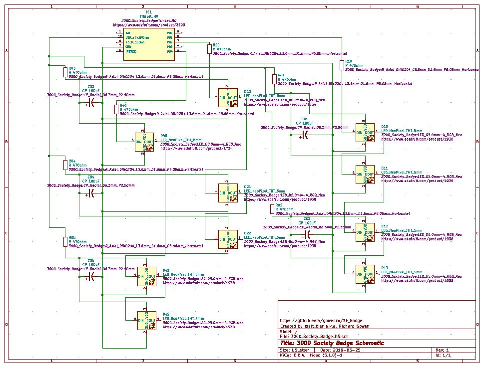
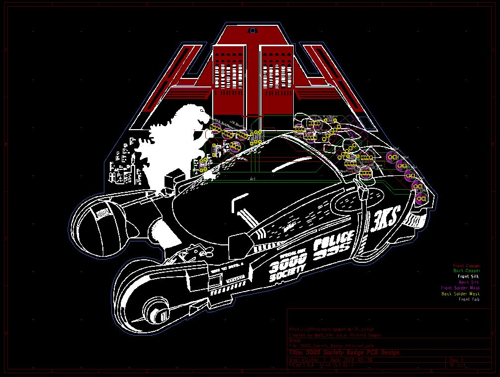
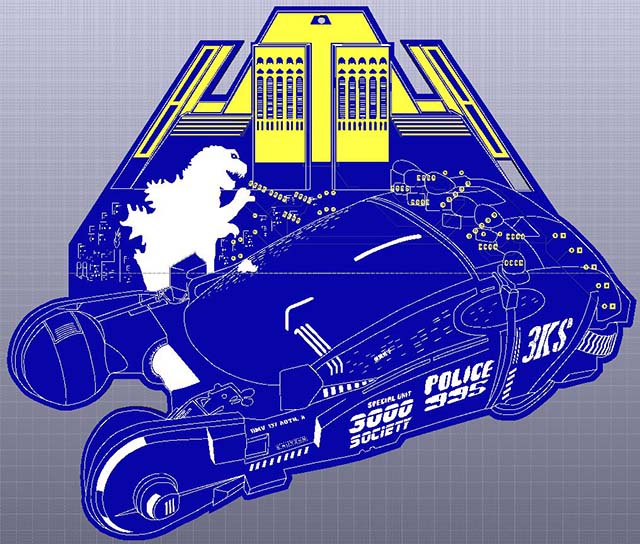
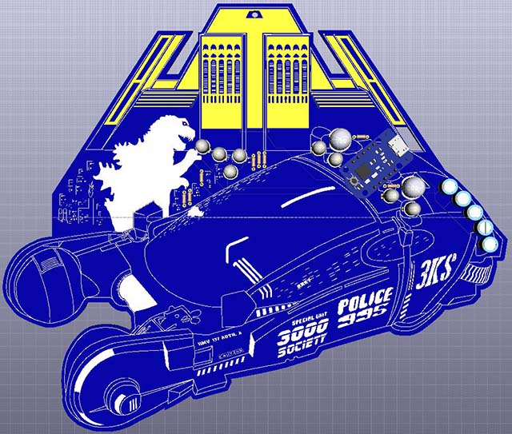
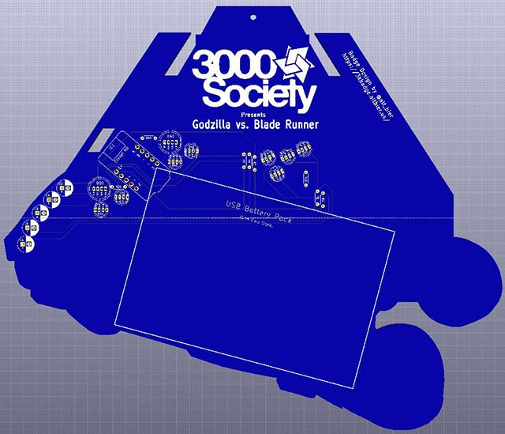

# 3k_badge

3000 Society Badge Documents

## File Structure

This is the file structure of this repository

* 3k_badge_eda - Electronic Design Automation files for the badge PCB (EDA is KiCad)
  * 3000_Society_Badge_K5 - KiCad project folder
* code - Code for programming the badge
  * 3kcode - Current test python code for trinket m0
* docs - Documentation created by this project related to the badge
* graphics - Artwork and other graphics created by this project for the badge
* reference - Documentation pulled from other sources related to the badge

## Badge Details

The 3000 Society Badge is being created to commemorate the 10th anniversary of this awesome gaming group.

The theme for 3000 Society 2019 is Godzilla vs. Blade Runner which has been used as the concept for the badge.

The badge PCB is a two layer board with through holes for THT components which include an Adafruit Trinket M0, ten Neopixel addressable LEDs, and all the resistors and capacitors to support them.
The PCB also has a capacitive touch area that uses the touch capabilities of the Trinket.

The electronic schematic for the badge can be found here: [3000_Society_Badge_Schematic_v1.pdf](docs/3000_Society_Badge_Schematic_v1.pdf)

The PCB CAD design for the badge can be found here:
[3000_Society_Badge_PCB_v1.pdf](docs/3000_Society_Badge_PCB_v1.pdf)

Here are some 3D renders of the badge:

