# Godzilla vs. Blade Runner Badge Assembly

[HOME](/) - [DETAILS](3kbadge_details.md) - [PARTS](3kbadge_components.md) - [ASSEMBLY](3kbadge_assembly.md) - [CODE](3kbadge_code.md)

This is where you will find detailed step by step instructions on how to assemble the badge.

## Assembly steps

1. Solder the Trinket M0 header pins
  * The Trinket comes with a single breakable 1x16pin header strip.  Break off two 5 pin sections to use.
    * Save the left over 6 pin male header to use later
  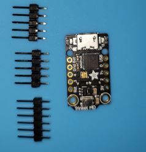
  * Place the two five pin header strips into the Trinket PCB inserting the short end into the through holes.
  * Solder these header pins on the top of the Trinket PCB
  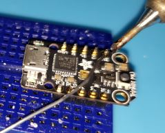
  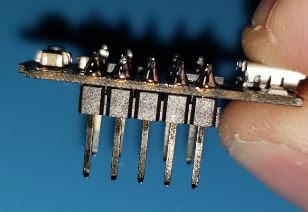

2. Solder the resistors to the Badge
  * Place the eight resistors into the badge PCB through holes with the components on the front of the PCB.
  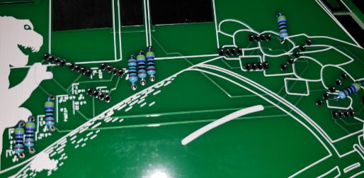
    * Bending the resistor legs slightly will hold them in place.
    * The direction the resistor is placed does not matter.
    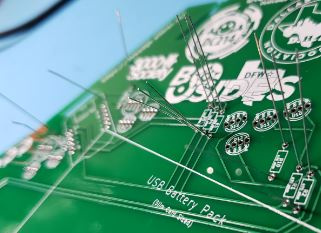
  * Be sure that the 100ohm resistor is in the R3 position mark on the back of the PCB.
  * Solder the resistors on the back of the PCB.
  * Cut off the resistor pins close to the back of the PCB (not too close or it will damage your solder joints)
  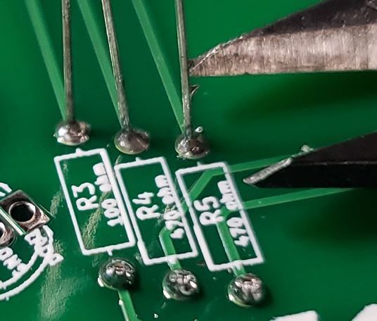

3. Solder the capacitors to the Badge
  * Place the five capacitors into the badge PCB through holes with the components on the front of the PCB.
  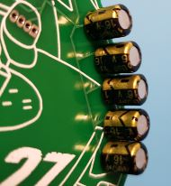
    * Bending the capacitor legs slightly will hold them in place.
    * The direction the capacitors are placed is IMPORTANT.  
      * The long leg is positive and the short leg where the 0 is printed on the cap is negative.  
      * The long positive legs should be nearer to the outside edge of the PCB.
      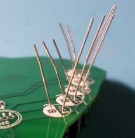
  * Solder the capacitors on the back of the PCB.
  * Cut off the capacitor pins close to the back of the PCB (not too close or it will damage your solder joints)
  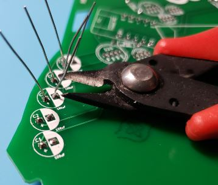

4. Solder the female headers to the Badge
  * Place the two 5 pin header strips male pins into the badge PCB through holes with the female headers on the front of the PCB.
    * Use the left over 6 pin male header from the Trinket to keep these headers at 90 degrees from the PCB.
      * The 6 pin male header is the perfect size to represent the trinket for spacing, just plug into the middle of each female header
      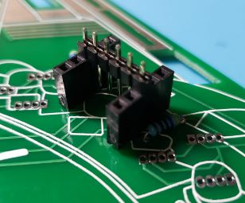
    * Place the board down on the headers or use a bit of tape on the front to hold them in place.
    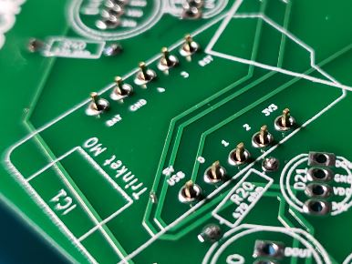  
  * Solder the headers on the back of the PCB.
  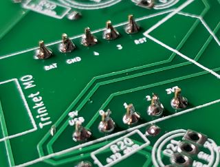

5. Solder the NeoPixel LEDs to the Badge
  * Place the ten NeoPixel LEDs into the badge PCB through holes with the components on the front of the PCB.
  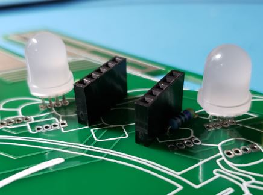
    * With four legs they should stay in place by friction alone. However, you can bend the LED legs slightly if needed.
    * The direction the NeoPixel LEDs are placed is IMPORTANT.  
      * On the 5mm LEDs the long leg should go in the through hole that is a rectangle instead of an oval.
        * The long leg is on the side of the LED that has a flat notch.  The back of the PCB shows where this notch should be aligned.
        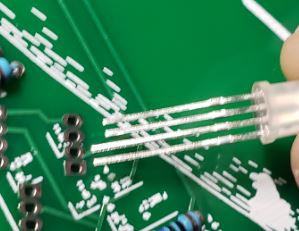  
      * On the 8mm LEDs the long leg should go in through hole that is the oval pad next to the rectangle one.
        * On these bigger LEDs the long leg is pin 2 not pin 1 like the smaller LEDs
        * The long leg is on the side of the LED that has a flat notch.  The back of the PCB shows where this notch should be aligned.
        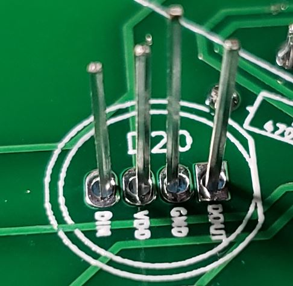
    * I would suggest placing and then soldering only a few LEDs at a time because they are very close together.
  * Solder the NeoPixel LEDs on the back of the PCB.
  * Cut off the LED pins close to the back of the PCB (not too close or it will damage your solder joints)
  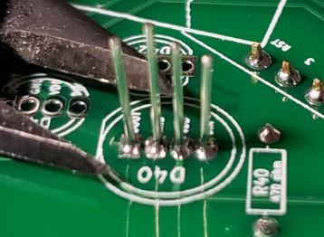

6. Insert the Trinket m0 onto the badge
  * Place the Trinket m0 male pins into the female headers on the front of the board
  * Be sure to align the Trinket with its USB connector towards the edge of the PCB
  * Each Trinket has been preloaded with the code to control the badge.  See the code link above for details.
  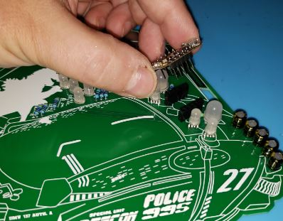

7. Attach the Battery to the badge
  * Apply the Velcro strip to the badge PCB (Use the soft Velcro here in case you wear the badge without the battery)
  * Apply the Velcro strip to the Battery
  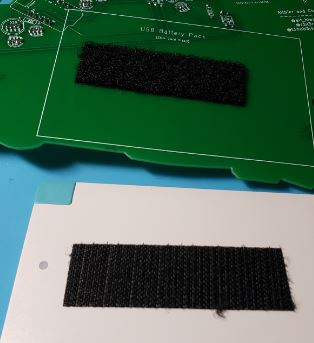
  * Feed the Battery cable through the rectangle hole in the PCB
  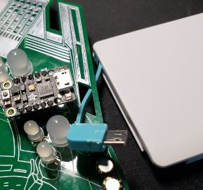
  * Connect the Battery cable to the Trinket
    * Do this before you attach the Battery to the badge to avoid having to make readjustments
    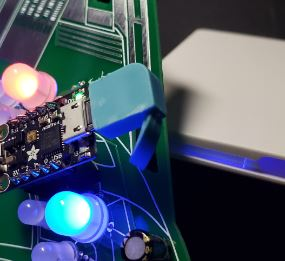
  * Attach the Battery to the back of the badge by sticking the Velcro strips together
  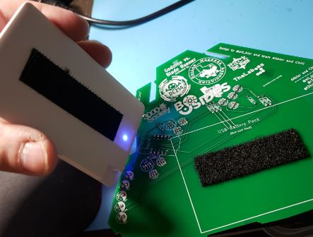

8. Attach the Lanyard to the badge
  * The Lanyard J Clip should clip into the hole at the top center of the badge PCB
  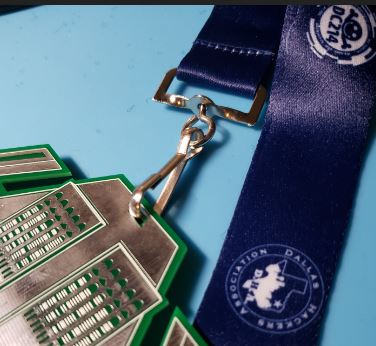

9. Rock the badge at the CON!
  * Touching the Tyrel building will change LED modes.
  * One of the LED modes is all off in case you need to quickly turn off without removing the battery.
  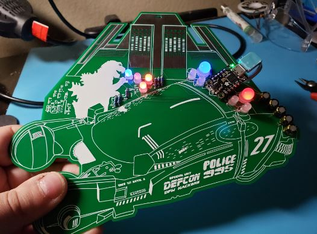
