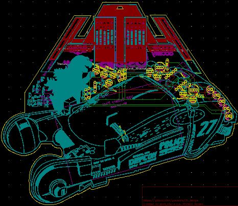
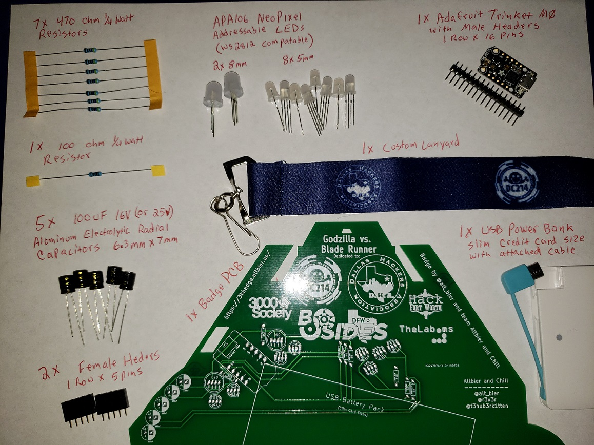

# Godzilla vs. Blade Runner Badge Details

[HOME](/) - [DETAILS](3kbadge_details.md) - [PARTS](3kbadge_components.md) - [ASSEMBLY](3kbadge_assembly.md) - [CODE](3kbadge_code.md) - [I_WANT_ONE!](3kbadge_i_want_one.md)

The badge PCB is a two layer board with through holes for THT components which include an Adafruit Trinket M0, ten Neopixel addressable LEDs (2x8mm,8x5mm), and all the resistors and capacitors to support them.
It is powered by a credit card sized USB battery bank that will be attached to the back via Velcro and have its cable feed through a hole designed into the PCB for this purpose.

The PCB also has a capacitive touch area that uses the touch capabilities of the Trinket M0.  All the exposed copper areas are wired to a single touch pin (with the exception of the central 'T' which was excluded to prevent a short with the lanyard)

It also comes with a custom printed lanyard that either has the 3000 Society logo or the DC214 and DHA logos depending on which version of the badge you have.

The PCB CAD design for the 3000 Society badge can be found here:
[3000_Society_Badge_PCB_v3.pdf](3000_Society_Badge_PCB_v3.pdf)

The PCB CAD design for the Defcon 27 badge can be found here:
[DC27_3k_Badge_PCB_v1.pdf](DC27_3k_Badge_PCB_v1.pdf)

The electronic schematic for the badge can be found here (same schematic for both versions): [3000_Society_Badge_Schematic_v3.pdf](3000_Society_Badge_Schematic_v3.pdf)

The complete components list is available here: [3kbage_components](3kbadge_components.md)

