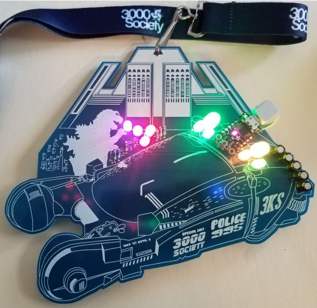
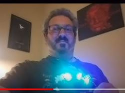

# Godzilla vs. Blade Runner Badge

[HOME](/) - [DETAILS](3kbadge_details.md) - [PARTS](3kbadge_components.md) - [ASSEMBLY](3kbadge_assembly.md) - [CODE](3kbadge_code.md) - [I_WANT_ONE!](3kbadge_i_want_one.md)

The 3000 Society Badge was created by [@alt_bier](https://twitter.com/alt_bier) to commemorate the 10th anniversary of this awesome gaming group for their conference May 31st - June 1st 2019.
The theme for 3000 Society 2019 conference was Godzilla vs. Blade Runner which has been used as the concept for the badge.

This badge has been reworked by team **Altbier and Chill** for the [Defcon 27](https://www.defcon.org/html/defcon-27/dc-27-index.html) conference in dedication to the DFW area Hackers:

| <A HREF="http://dc214.org/">DC214</A> | <A HREF="https://www.dallashackers.com/">DHA</A> | <A HREF="https://thelab.ms/">TheLab.ms</A> |
| <A HREF="https://www.meetup.com/HackFtW/">HackFtW</A> | <A HREF="http://www.bsidesdfw.com//">BSides DFW</A> | and more... |

A portion of the proceeds will be donated to [BSides DFW](http://www.bsidesdfw.com/) to help this awesome conference.

Here is a picture of the badge fully assembled (3000 Society Conference Version):

Since a picture alone doesn't capture the scale or the blinkey lights I put together a quick video for your enjoyment:

## Altbier and Chill

* [@alt_bier](https://twitter.com/alt_bier)
* [@r3x3r](https://twitter.com/r3x3r)
* [@t3hub3rk1tten](https://twitter.com/t3hub3rk1tten)
