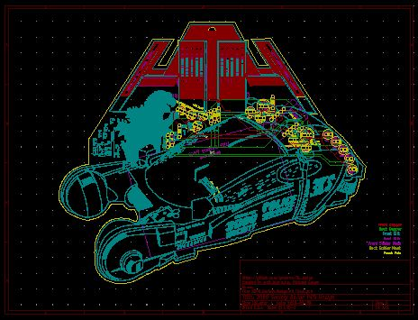
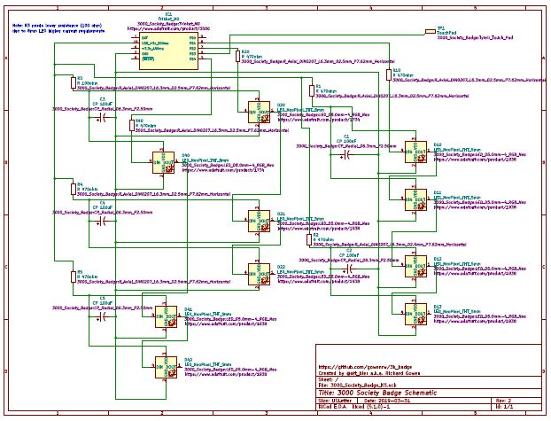

# 3000 Society Badge Details

The 3000 Society Badge is being created to commemorate the 10th anniversary of this awesome gaming group.

The theme for 3000 Society 2019 is Godzilla vs. Blade Runner which has been used as the concept for the badge.

Here is a picture of the badge fully assembled:

Since a picture alone doesn't capture the scale or the blinkey lights I put together a quick video on the 3000 Society Badge 2019 for your enjoyment:
https://youtu.be/W0jq3bSK5AE

The badge PCB is a two layer board with through holes for THT components which include an Adafruit Trinket M0, ten Neopixel addressable LEDs (2x8mm,8x5mm), and all the resistors and capacitors to support them.
It is powered by a credit card sized USB battery bank that will be attached to the back via Velcro and have its cable feed through a hole designed into the PCB for this purpose.
The complete components list is available here: [3kbage_components](3kbadge_components.md)

The PCB also has a capacitive touch area that uses the touch capabilities of the Trinket M0.  All the exposed copper areas are wired to a single touch pin (with the exception of the central 'T' which was excluded to prevent a short with the lanyard)

The PCB CAD design for the badge can be found here:
[3000_Society_Badge_PCB_v3.pdf](3000_Society_Badge_PCB_v3.pdf)

The electronic schematic for the badge can be found here: [3000_Society_Badge_Schematic_v3.pdf](3000_Society_Badge_Schematic_v3.pdf)

